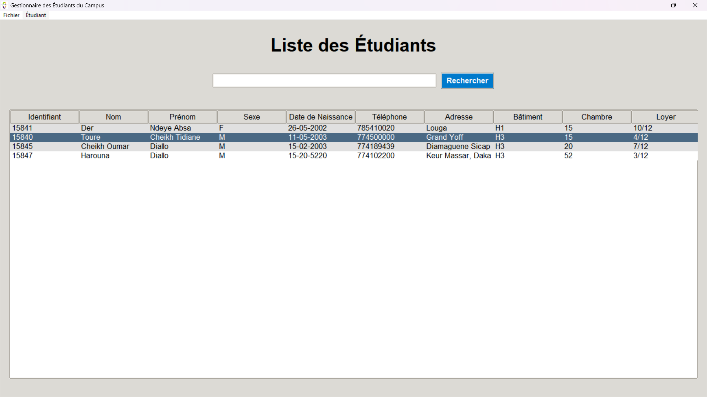
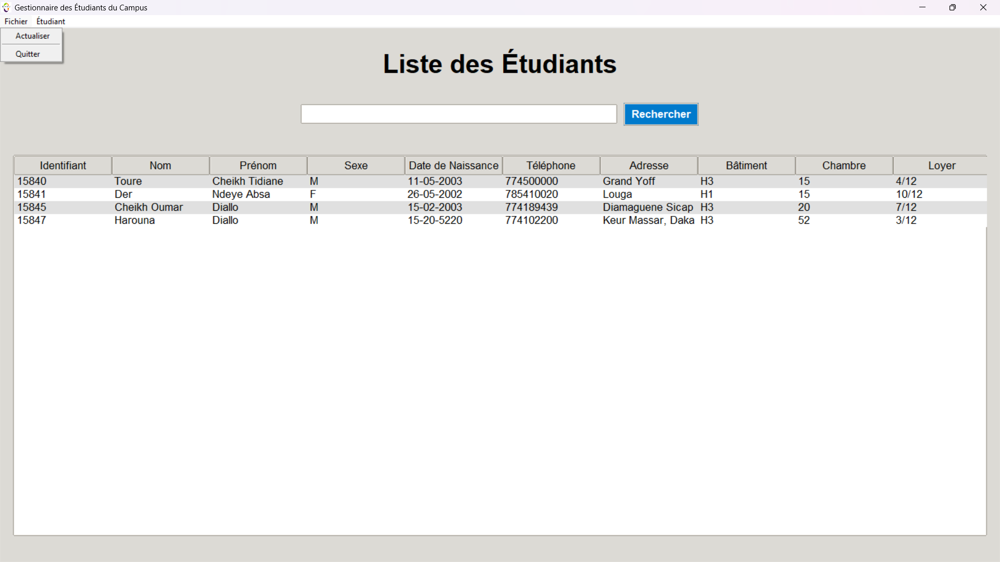
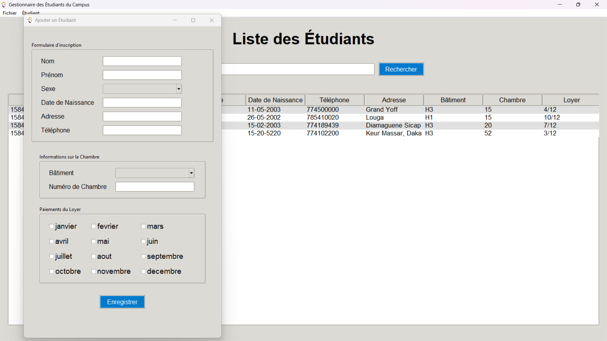
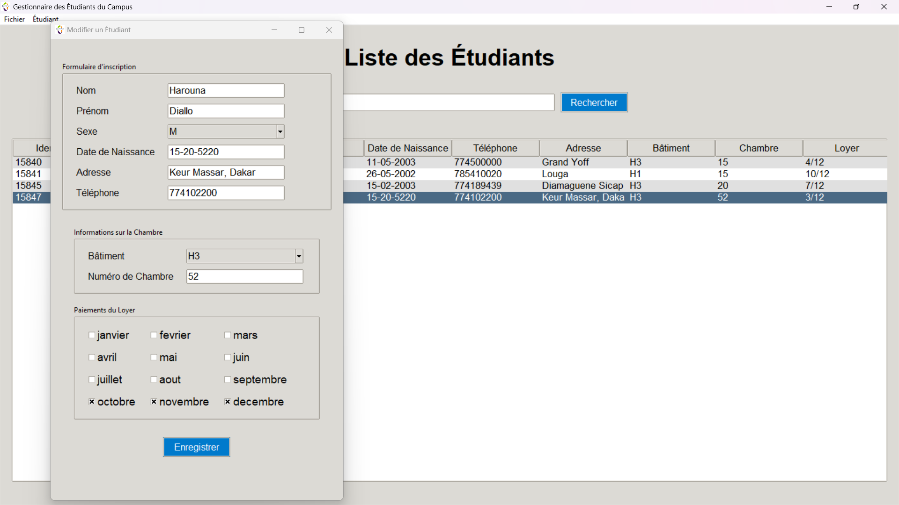
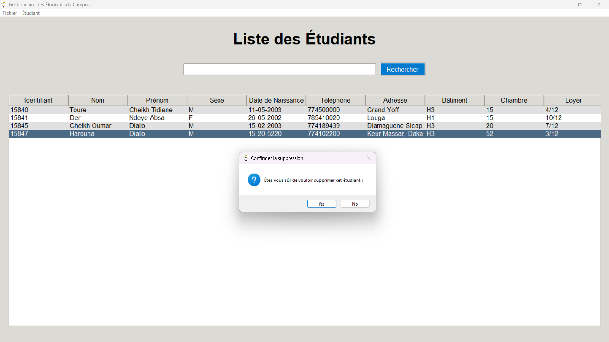
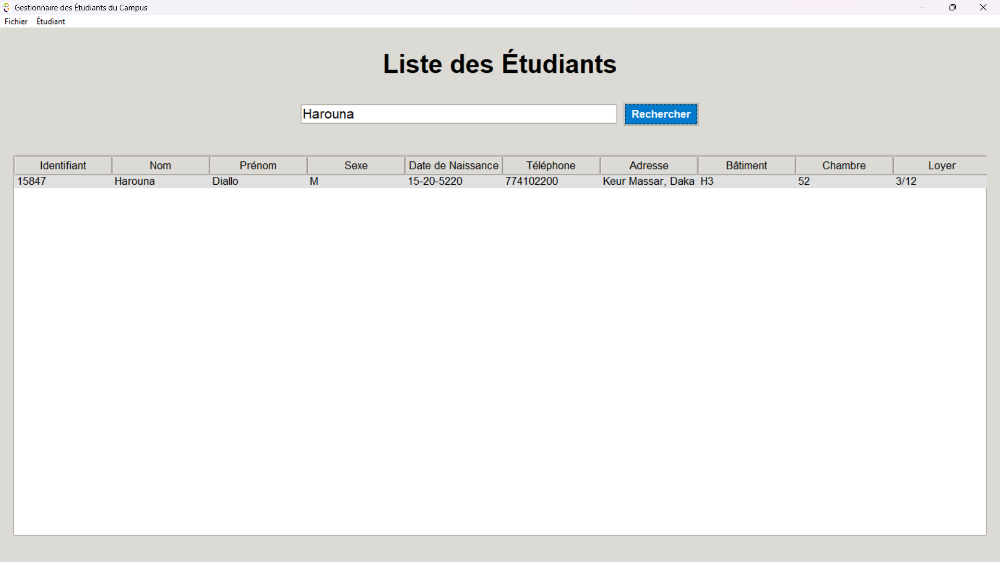

# CampusManager


# Gestion des Hébergements - Application Tkinter

## Description
Cette application de gestion des hébergements pour un campus social permet de gérer les informations des étudiants, y compris leur bâtiment, leur chambre, ainsi que le suivi des paiements des loyers. L'interface est développée avec Python et Tkinter, et les données sont stockées dans une base de données SQLite.

## Fonctionnalités
- Ajouter, modifier et supprimer des étudiants.
- Suivre les paiements mensuels des loyers.
- Trier les données selon différents critères (nom, bâtiment, chambre, etc.).
- Interface intuitive avec recherche intégrée.
- Gestion automatique des identifiants d'étudiants via SQLite.

## Prérequis
Avant d'exécuter l'application, assurez-vous d'avoir installé les prérequis suivants :

- Python 3.x
- Les bibliothèques suivantes :
  - Tkinter (inclus avec Python)
  - SQLite3 (inclus avec Python)


## Installation

1. Clonez ce dépôt :
   ```bash
   git clone https://github.com/cheikhouma/CampusManager.git
   ```

2. Accédez au répertoire cloné :
   ```bash
   cd campusmanager
   ```

3. Installez les dépendances :
   ```bash
   pip install -r requirements.txt
   ```

4. Lancez l'application :
   ```bash
   python main.py
   ```

## Utilisation

### Ajouter un étudiant
1. Cliquez sur le bouton **Ajouter un étudiant** pour ouvrir la fenêtre d'ajout.
2. Remplissez les informations nécessaires (nom, prénom, bâtiment, etc.) et cliquez sur **Enregistrer**.

### Suivre les paiements
1. Cliquez sur la ligne puis **etudiant** ensuite **modifier**.
2. Cochez ou décochez les mois en fonction des paiements effectués, puis cliquez en dehors de la fenêtre pour sauvegarder.

### Tri et Recherche
- Utilisez les boutons en haut de chaque colonne pour trier les données.
- Entrez des mots-clés dans le champ de recherche pour filtrer la liste des étudiants.

## Captures d'écran

### 1. Page d'accueil


### 2. Formulaire d'ajout d'étudiant


### 3. Liste des étudiants


### 4. Formulaire de modification d'étudiant


### 5. Sélection des paiements des mois


### 6. Suppression 


### 7. Résultat de la recherche



## Contributions
Les contributions sont les bienvenues ! Si vous souhaitez améliorer l'application, veuillez :

1. Forker le projet.
2. Créer une nouvelle branche : `git checkout -b feature/amélioration`.
3. Effectuer vos modifications.
4. Soumettre une Pull Request.

## Licence
Ce projet est sous licence [MIT](https://opensource.org/licenses/MIT).

